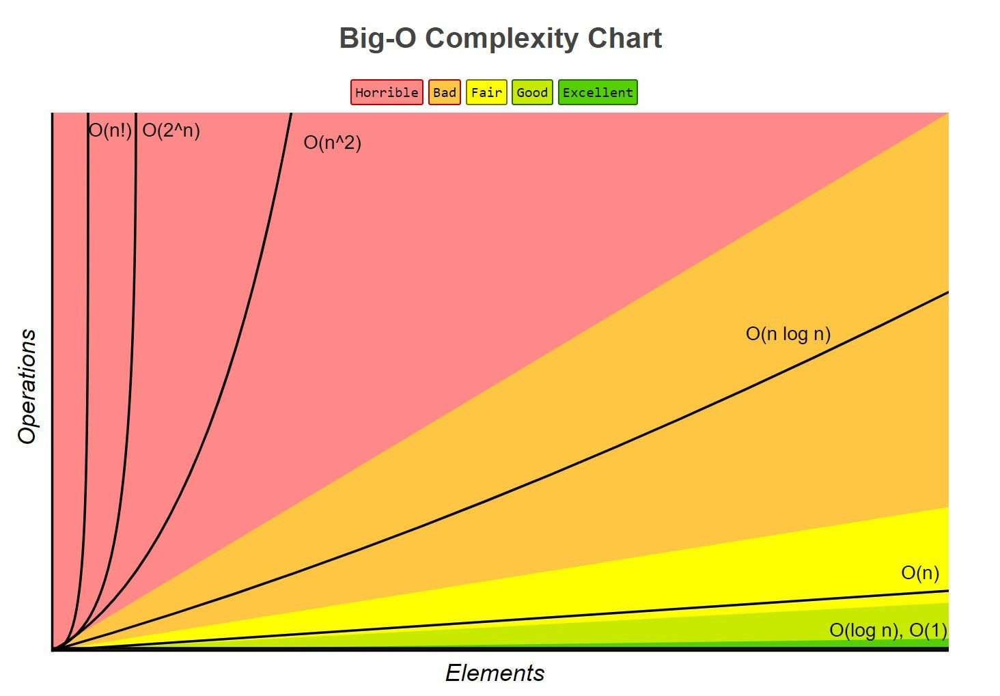

# Introducción a la Complejidad Algorítmica

Este documento proporciona una introducción a la complejidad algorítmica, basada en el curso de [David Aroesti](https://github.com/jdaroesti) en [Platzi](https://platzi.com). La complejidad algorítmica es una medida de cuánto tiempo o espacio consume un algoritmo en función del tamaño de su entrada.

## Tipos de Complejidad Algorítmica

- **O(1) Constante**: Independientemente del tamaño de la entrada, el tiempo de ejecución del algoritmo es constante.

- **O(n) Lineal**: El tiempo de ejecución del algoritmo aumenta linealmente con el tamaño de la entrada.

- **O(log n) Logarítmica**: El tiempo de ejecución del algoritmo aumenta logarítmicamente con el tamaño de la entrada. Esto significa que el tiempo de ejecución aumenta rápidamente al principio y luego se estabiliza.

- **O(n log n) Log lineal**: El tiempo de ejecución del algoritmo aumenta de forma logarítmica, pero se multiplica por una constante.

- **O(n²) Polinomial**: El tiempo de ejecución del algoritmo aumenta cuadráticamente con el tamaño de la entrada. Los algoritmos con esta complejidad deben evitarse a menos que el tamaño de la entrada sea pequeño.

- **O(2^n) Exponencial**: El tiempo de ejecución del algoritmo aumenta exponencialmente con el tamaño de la entrada. Estos algoritmos tienen una carga muy alta y deben evitarse en la mayoría de los casos.

- **O(n!) Factorial**: El tiempo de ejecución del algoritmo aumenta factorialmente con el tamaño de la entrada. Al igual que los algoritmos exponenciales, estos algoritmos tienen una carga muy alta y deben evitarse.



# Búsqueda Lineal

Este script realiza una búsqueda lineal en una lista de números aleatorios.

## Requisitos

- Python 3

## Ejecución

Para ejecutar este script, sigue estos pasos:

1. Abre una terminal.

2. Navega a la carpeta `scripts` donde se encuentra el script `busqueda_lineal.py`. Puedes hacerlo con el comando `cd`, por ejemplo:

    ```bash
    cd ruta/a/la/carpeta/scripts
    ```

3. Ejecuta el script con Python:

    ```bash
    python3 busqueda_lineal.py
    ```

4. El script te pedirá que introduzcas el tamaño de la lista y el número que quieres encontrar. Introduce estos valores cuando se te solicite.

El script generará una lista de números aleatorios del tamaño que hayas especificado, realizará una búsqueda lineal para encontrar el número que has introducido, e imprimirá la lista y el resultado de la búsqueda.

 # Búsqueda Binaria

Este script realiza una búsqueda binaria en una lista de números aleatorios. La búsqueda binaria es un algoritmo que encuentra un elemento en una lista ordenada dividiendo la lista en mitades. La complejidad de tiempo de este algoritmo es O(log n), lo que significa que el tiempo de ejecución aumenta logarítmicamente con el tamaño de la entrada.


## Ejecución

Para ejecutar este script, sigue estos pasos:

1. Abre una terminal.

2. Navega a la carpeta `scripts` donde se encuentra el script `busqueda_binaria.py`. Puedes hacerlo con el comando `cd`, por ejemplo:

    ```bash
    cd ruta/a/la/carpeta/scripts
    ```

3. Ejecuta el script con Python:

    ```bash
    python3 busqueda_binaria.py
    ```

4. El script te pedirá que introduzcas el tamaño de la lista y el número que quieres encontrar. Introduce estos valores cuando se te solicite.

El script generará una lista de números aleatorios del tamaño que hayas especificado, ordenará la lista, realizará una búsqueda binaria para encontrar el número que has introducido, e imprimirá la lista y el resultado de la búsqueda.

# Bubble Sort

Este script realiza un ordenamiento de burbuja (Bubble Sort) en una lista de números aleatorios. Bubble Sort es un algoritmo de ordenamiento simple que repite pasos de pasar por la lista, comparar elementos adyacentes y cambiarlos si están en el orden incorrecto. Este proceso se repite hasta que no se necesiten más intercambios, lo que indica que la lista está ordenada. La complejidad de tiempo de este algoritmo es O(n²), lo que significa que el tiempo de ejecución aumenta cuadráticamente con el tamaño de la entrada.

## Ejecución

El script te pedirá que introduzcas el tamaño de la lista. Introduce este valor cuando se te solicite.

El script generará una lista de números aleatorios del tamaño que hayas especificado, ordenará la lista utilizando el algoritmo Bubble Sort, e imprimirá la lista antes y después del ordenamiento.

    De que tamano sera la lista? 10
    Antes [39, 91, 33, 39, 9, 97, 74, 74, 39, 23]
    Despues [9, 23, 33, 39, 39, 39, 74, 74, 91, 97]

# Ordenamiento por Mezcla (Merge Sort)

Este script realiza un ordenamiento por mezcla en una lista de números aleatorios. El ordenamiento por mezcla es un algoritmo de tipo divide y vencerás que divide la lista desordenada en n sublistas, cada una conteniendo un elemento (una lista de un elemento se considera ordenada), y luego combina repetidamente las sublistas para producir nuevas sublistas ordenadas hasta que solo queda una. La complejidad temporal de este algoritmo es O(n log n), lo que significa que el tiempo de ejecución aumenta logarítmicamente con el tamaño de la entrada.

## Ejecución

El script te pedirá que introduzcas el tamaño de la lista. Introduce este valor cuando se te solicite.

El script generará una lista de números aleatorios del tamaño que hayas especificado, ordenará la lista utilizando el algoritmo de ordenamiento por mezcla, e imprimirá la lista antes y después del ordenamiento.

Ejemplo:

    ```bash
    ¿De qué tamaño será la lista? 10
    [39, 91, 33, 39, 9, 97, 74, 74, 39, 23]
    --------------------
    Lista ordenada [9, 23, 33, 39, 39, 39, 74, 74, 91, 97]

***# Creación del directorio graficado y activación del entorno virtual

Para crear el directorio `graficado`, se utilizó el siguiente comando:

    mkdir graficado

Una vez creado el directorio, se activó el entorno virtual utilizando el comando:

    source venv/bin/activate

Con el entorno virtual activado, se instaló la biblioteca Bokeh para la creación de gráficos interactivos:
    
    pip install bokeh***